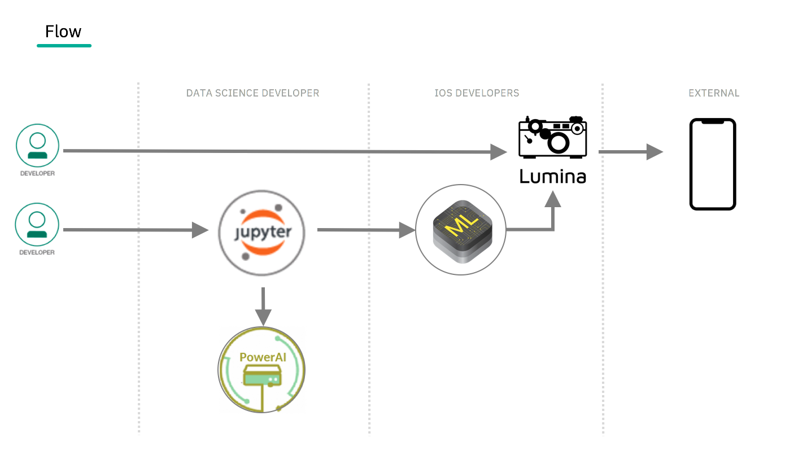
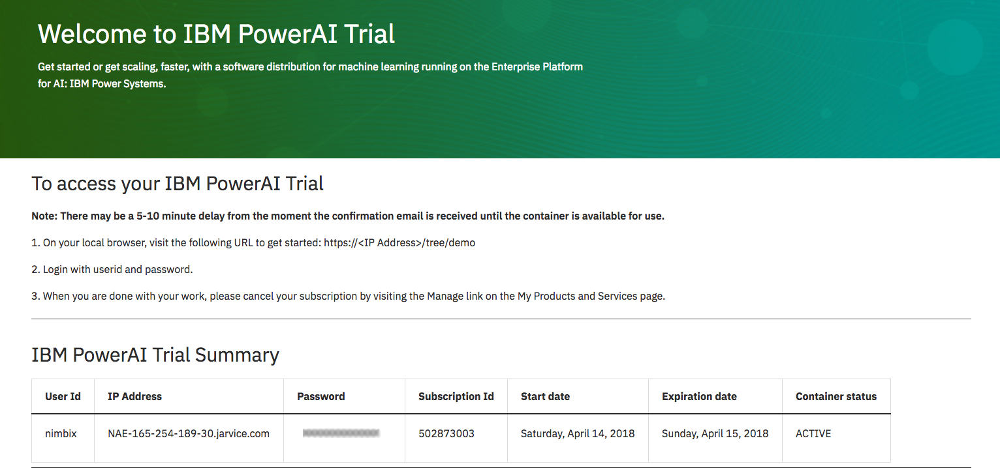

# seeFOOD CNN, a binary classifier written in Keras and converted to CoreML

In this Code Pattern, we will walk you through how to use GPU hardware in the Cloud with Nimbix, to quickly train and deploy a Convolutional Neural Network model that can tell you whether your lunchtime nutritional choice is the right one -- all with the camera of the mobile phone in your pocket. All you need are some photos and descriptions of them. You can be up and running with a model to stream video through in no time flat.

I'm sure you've seen the episode of Silicon Valley, but to give you an idea of the amazing technology we are going to share with you today, here's a clip:

<p align="center">
    <a href="https://www.youtube.com/watch?v=ACmydtFDTGs" target="_blank">
        
    </a>
</p>

So you want to identify hotdogs -- great! Summer is just around the corner, and you can never be too careful with what you're eating. You too can develop an app that identifies **Hot Dog** and the alternatives... **Not Hot Dog**

This repo will walk you through the steps, and technologies to train a Deep Learning model using a Convolutional Netural Network, evaluate its accuracy, and save it into a format that can be loaded on an iOS device. With a model converted to Apple's CoreML format we will load a `.mlmodel` into an open source project: [Lumina](https://github.com/dokun1/lumina).  Within Lumina you can quickly import and activate your .mlmodel, and stream object predictions in real time from the camera feed... Let me repeat, you can stream object predictions from the camera feed in real time -- and you can do this with one line of code.

When the reader has completed this Code Pattern, they will understand how to:

* Run a Jupyter Notebook with PowerAI
* Train a Convolutional Neural Network model with Keras
* Convert a Keras model to Apple's CoreML
* Use Lumina to create an iOS app that uses your binary classifier



## Flow
1. Run the Jupyter Notebook with PowerAI
2. Download the `seefood.mlmodel` file from Nimbix
3. Implement your model with Lumina
4. Run your app

## Included components
* [IBM Power Systems](https://www-03.ibm.com/systems/power/): A server built with open technologies and designed for mission-critical applications.
* [IBM Power AI](https://www.ibm.com/ms-en/marketplace/deep-learning-platform): A software platform that makes deep learning, machine learning, and AI more accessible and better performing.
* [Jupyter Notebook](http://jupyter.org/): An open source web application that allows you to create and share documents that contain live code, equations, visualizations, and explanatory text.
* [Nimbix Cloud Computing Platform](https://www.nimbix.net/): An HPC & Cloud Supercomputing platform enabling engineers, scientists & developers, to build, compute, analyze, and scale simulations in the cloud.
* [Keras](https://keras.io/): A high-level neural networks API, written in Python, and capable of running on top of TensorFlow, CNTK, or Theano.
* [Tensorflow](https://www.tensorflow.org/): An open source software library for numerical computation using data flow graphs.

## Featured technologies
* [CoreMLTools](https://github.com/apple/coremltools): Integrates trained machine learning models into your iOS app.
* [Lumina](https://github.com/dokun1/lumina): An iOS camera designed in Swift that can use any CoreML model for object recognition, as well as streaming video, images, and qr/bar codes.
* [Artificial Intelligence](https://medium.com/ibm-data-science-experience): Artificial intelligence can be applied to disparate solution spaces to deliver disruptive technologies.
* [Cloud](https://www.ibm.com/developerworks/learn/cloud/): Accessing computer and information technology resources through the Internet.
* [Data Science](https://medium.com/ibm-data-science-experience/): Systems and scientific methods to analyze structured and unstructured data in order to extract knowledge and insights.
* [Mobile](https://mobilefirstplatform.ibmcloud.com/): Systems of engagement are increasingly using mobile technology as the platform for delivery.
* [Python](https://www.python.org/): Python is a programming language that lets you work more quickly and integrate your systems more effectively.

<!--
# Watch the Video
[](https://www.youtube.com/watch?v=TODO)
-->

# Steps

Follow these steps to setup and run this *phenomenon sweeping the vegan meat industry*. The steps are described in detail below.

## Using the Nimbix and PowerAI

1. [Get 24-hours of free access to the PowerAI platform](#1-get-24-hours-of-free-access-to-the-powerai-platform)
1. [Access and start the Jupyter Notebook](#2-access-and-start-the-jupyter-notebook)
1. [Run the notebook](#3-run-the-notebook)
1. [Save and share your model ](#4-save-and-share-your-model)
1. [Implement Your Model With Lumina](#5-Implement-Your-Model-With-Lumina)
1. [End your trial](#6-end-your-trial)

### 1. Get 24-Hours of free access to the PowerAI platform

IBM has partnered with Nimbix to provide cognitive developers a trial
account that provides 24-Hours of free processing time on the PowerAI
platform. Follow these steps to register for access to Nimbix to try
the PowerAI Cognitive Code Patterns and explore the platform.

Go to the [IBM Marketplace PowerAI Portal](https://www.ibm.com/us-en/marketplace/deep-learning-platform), and click `Start your free trial`.

On the IBM PowerAI Trial page, shown below, enter the required information to sign up for an IBM account and click `Continue`. If you already have an IBM ID, click `Already have an account? Log in`, enter your credentials and click `Continue`.


On the **Almost there…** page, shown below, enter the required information and click `Continue` to complete the registration and launch the **IBM Marketplace Products and Services** page.


Your **IBM Marketplace Products and Services** page displays all offerings that are available to you; the PowerAI Trial should now be one of them. From the PowerAI Trial section, click `Launch`, as shown below, to launch the **IBM PowerAI trial** page.


The **Welcome to IBM PowerAI Trial** page provides instructions for accessing the trial, as shown below. Alternatively, you will receive an email confirming your registration with similar instructions that you can follow to start the trial.



Summary of steps for starting the trial:

* Use your browser to go to the URL as directed. Use the IP Address provided in the table. It may be a fully qualified domain name.

* Login with the User Id and Password given in the table.

### 2. Access and start the Jupyter Notebook

Use git clone to download the example notebook.

* Get a new terminal window by clicking on the ```New``` pull-down and selecting ``Terminal``.

  

* Run the following command to clone the git repo:

  ```commandline
  git clone https://github.com/justinmccoy/keras-binary-classifier
  ```

* Once done, you can exit the terminal and return to the notebook browser. Use the ``Files`` tab and click on ``keras-binary-classifier`` then ``notebooks`` and then ``Hotdog_NotHotdog_CNN.ipynb`` to open the notebook.

### 3. Run the notebook

When a notebook is executed, what is actually happening is that each code cell in
the notebook is executed, in order, from top to bottom.

Each code cell is selectable and is preceded by a tag in the left margin. The tag
format is `In [x]:`. Depending on the state of the notebook, the `x` can be:

* A blank, this indicates that the cell has never been executed.
* A number, this number represents the relative order this code step was executed.
* A `*`, this indicates that the cell is currently executing.

There are several ways to execute the code cells in your notebook:

* One cell at a time.
  * Select the cell, and then press the `Play` button in the toolbar.
* Batch mode, in sequential order.
  * From the `Cell` menu bar, there are several options available. For example, you
    can `Run All` cells in your notebook, or you can `Run All Below`, that will
    start executing from the first cell under the currently selected cell, and then
    continue executing all cells that follow.

### 4. Save and share your model

Because this notebook is running temporarily on a Nimbix
Cloud server, use the following options to save your work:

Under the `File` menu, there are options to:

* `Download as...` will download the notebook to your local system.
* `Print Preview` will allow you to print the current state of the
  notebook.

Select `Download  as...` and then `seefood.mlmodel` to download your trained food classifier.

### 5. Implement your model with Lumina

You'll need to start an iOS project that uses the **Lumina** framework. You can either clone the repository [here](https://github.com/dokun1/lumina) and use the `LuminaSample` app in the main workspace, or you can make your own iOS app using the framework. Watch [this](https://www.youtube.com/watch?v=8eEAvcy708s) video for more information on using Lumina.

Once you have a project open with Lumina integrated, make sure you implement a camera with at least the following code:

```swift
let camera = LuminaViewController()
camera.delegate = self
camera.streamingModelTypes = [seefood()]
present(camera, animated: true)
```

At this point, your iOS app is already making use of the `CoreML` functionality embedded in Lumina. Now, you need to actually do something with the data returned from it.

Extend your class to conform to `LuminaDelegate` like so:

```swift
extension ViewController: LuminaDelegate {
    func streamed(videoFrame: UIImage, with predictions: [LuminaRecognitionResult]?, from controller: LuminaViewController) {
    
    }
}
```

Results streamed from each video frame are given to you in this delegate method. In this example, you have created a binary classifier, so you should only expect one result with either a `1.0` or `0.0` result. Lumina has a built in text label to use as a prompt, so update your method to make use of it here like so:

```swift
func streamed(videoFrame: UIImage, with predictions: [LuminaRecognitionResult]?, from controller: LuminaViewController) {
    guard let predicted = predictions else {
        return
    }
    guard let value = predicted.first?.predictions?.first else {
        return
    }
    if value.confidence > 0 {
        controller.textPrompt = "\(String(describing: predicted.first?.type)): Not Hot Dog"
    } else {
        controller.textPrompt = "\(String(describing: predicted.first?.type)): Hot Dog"
    }
}
```

Run your app, and point the camera at a hot dog, then at anything that isn't a hot dog. The results speak for themselves!

### 6. End your trial

When you are done with your work, please cancel your subscription by issuing the following command in your ssh session or by visiting the `Manage` link on the **My Products and Services** page.

```sh
sudo poweroff --force
```

# See the result

<p align="center">
    
</p>


# Links
* [Free Trial to GPU Accelerated HW in the Cloud](https://developer.ibm.com/linuxonpower/cloud-resources/)
* [Learn how to use Lumina in an iOS app](https://www.youtube.com/watch?v=8eEAvcy708s)

# Learn more
* **Artificial Intelligence Code Patterns**: Enjoyed this Code Pattern? Check out our other [AI Code Patterns](https://developer.ibm.com/code/technologies/artificial-intelligence/).
* **Data Analytics Code Patterns**: Enjoyed this Code Pattern? Check out our other [Data Analytics Code Patterns](https://developer.ibm.com/code/technologies/data-science/)
* **AI and Data Code Pattern Playlist**: Bookmark our [playlist](https://www.youtube.com/playlist?list=PLzUbsvIyrNfknNewObx5N7uGZ5FKH0Fde) with all of our Code Pattern videos
* **Data Science Experience**: Master the art of data science with IBM's [Data Science Experience](https://datascience.ibm.com/)
* **PowerAI**: Get started or get scaling, faster, with a software distribution for machine learning running on the Enterprise Platform for AI: [IBM Power Systems](https://www.ibm.com/ms-en/marketplace/deep-learning-platform)

# License
[Apache 2.0](LICENSE)

